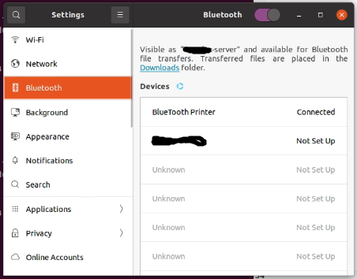
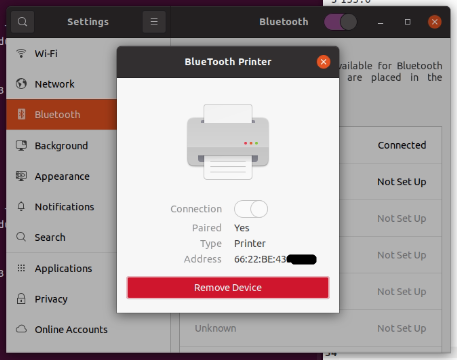
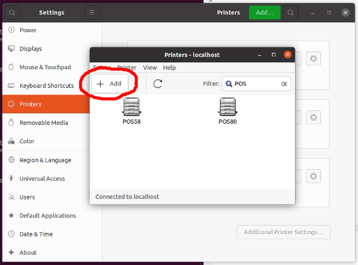
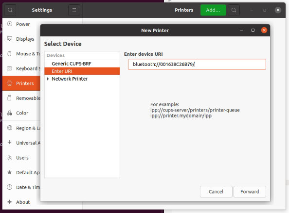
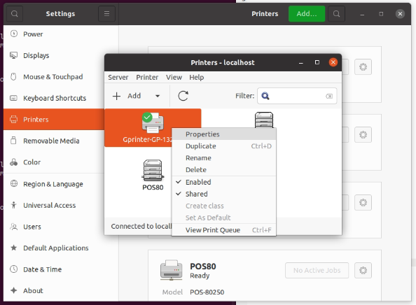
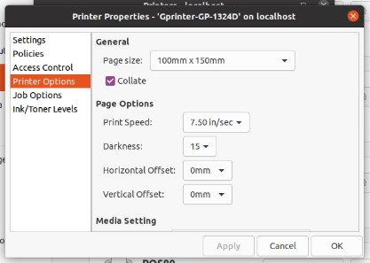

# Gprinter-1324D , ZJ-9200 Label / thermal printer bluetooth setup for Linux (Ubuntu)

Chinese thermal printer e.g. Gprinter-1324D , ZJ-9200, etc.  
For label printing 100x150cm, don't provide driver or setup packer for linux.  
And don't have any document about how to use it from bluetooth.  
So, after research and some hacking, it's finally work on my Ubuntu Server.  

การตั้งค่าเครื่องปริ้นความร้อนแบบ bluetooth สำหรับพ่อค้าแม่ค้า shopee, lazada ให้ใช้คอมที่ลง linux เช่น ubuntu สามารถสั่งพิมพ์ได้

## Setup

1. Download gprinter_1324D.ppd and rastertotspl from this repo or  
```
git clone https://github.com/TheGU/ubuntu_thermal_printer_setup.git
```
2. Open `terminal` then, as root, copy `rastertotspl` to `/usr/lib/cups/filter/rastertotspl` and change permission 
```
cd ubuntu_thermal_printer_setup
sudo cp rastertotspl /usr/lib/cups/filter/
sudo chmod 755 /usr/lib/cups/filter/rastertotspl
```
3. Open `Setting > Bluetooth` then connect to your printer  

4. Click on connected bluetooth printer to view mac address (in address section) and take note.  

5. Open `Setting > Printer > Add`   

6. Select `Enter URL`. In `Enter device URI` type `bluetooth://<MAC Address with out colon>/` for example `bluetooth://6622BE43XXXX/` (mac address from step 4. without colon ':') 

then click `Forward` ,choose printer name then Apply
7. Open printer properties to setup paper feed

8. On `Printer Options` setup `Page size` and tune `darkneess , feed offset , gap height` to match your printer feed speed and papersize.


---

### Reference

- [ZJ-9200 Label Printer](http://www.zjiang.com/en/init.php/product/index?id=55)
- [ZIJIANG Printer Driver / 资江苹果电脑驱动](http://www.zjiang.com/en/init.php/service/driver)
- [Bluetooth Printer Setup](https://help.ubuntu.com/community/BluetoothPrinterSetup)
- [Gprinter (佳博) 热敏纸打印机 Mac / Linux CUPS 驱动](https://tifan.net/blog/2018/03/27/gprinter-thermal-printer-unix-driver/)
- [热敏小票打印机 CUPS 驱动（Linux）在 Gprinter GP1324D 上测试成功](https://github.com/feisuzhu/gprinter-cups)